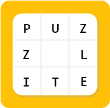
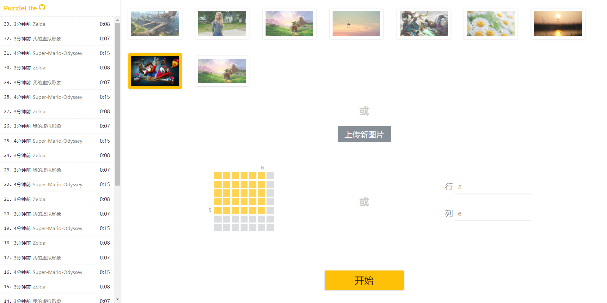
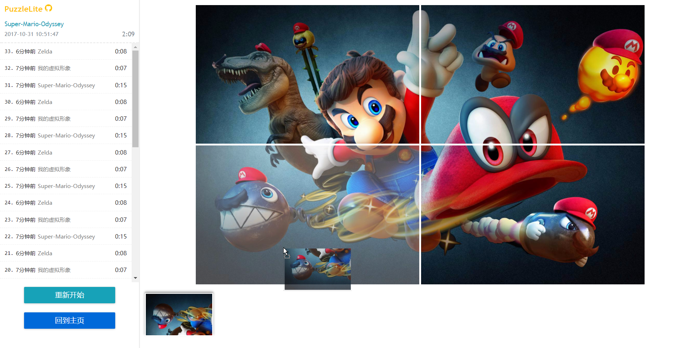

<h1 align="center">
	
  	<p>PuzzleLite</p>
	<br>
	<br>
</h1>

> 轻巧拼图小游戏，界面清爽、使用简单

## 特性
采用最新HTML5技术，图片用Canvas裁剪为设定数量，拖拽使用Drag&Drop API，游戏数据用sessionStorage在当前会话环境保存到本地

## 兼容性
HTML5+ ES6+

## 在线体验
[https://pysics.github.io/PuzzleLite/build/index.html](https://pysics.github.io/PuzzleLite/build/index.html)

## 本地体验

> 项目用原生js编写，但使用了一些较新的es6特性；css使用了PostCSS预处理器。因此提供以下两种方法


### 方法一
将build目录下，index.html和bundle.js两个文件拷贝出来即可使用。Babel和PostCSS已将项目所需的脚本和样式文件编译到bundle.js


### 方法二
搭建开发环境，确保本地安装了nodejs环境，并有npm或yarn包管理工具
> src为开发目录，app.js和app.css是项目原始文件，具有良好可读性。

- 下载或clone项目到本地
```
git clone https://github.com/Pysics/PuzzleLite.git
```

- 在项目根目录下载项目依赖
```
yarn && npm install
```

- 一切就绪，启动项目
```
yarn start && npm start
```

## BUG
- 拖拽图片到格子时一定几率会在多个格子上渲染当前图片
- FireFox浏览器下，拖拽缩略图过大

## 截图




